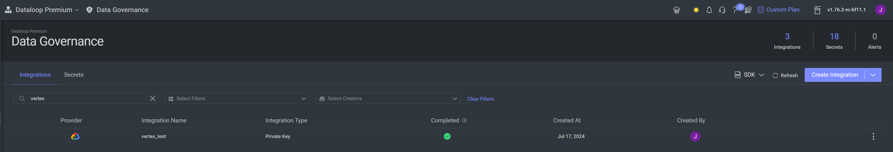
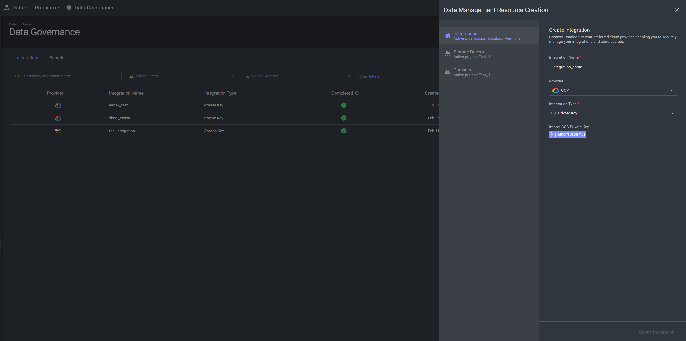
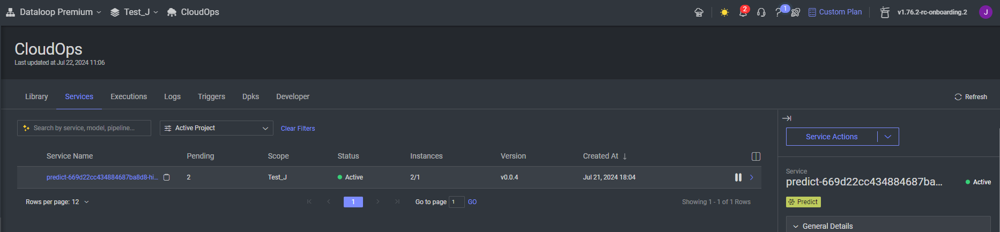
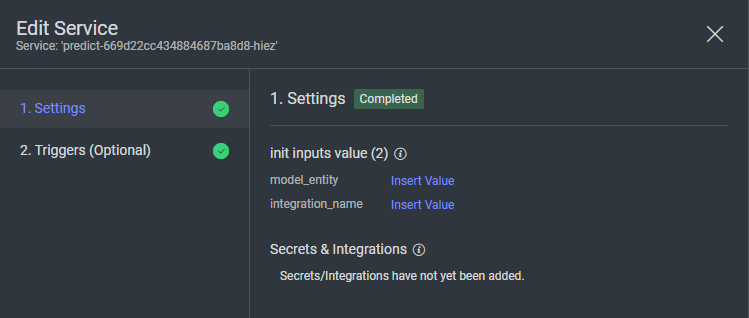

# Vertex AI Model Adapters

Welcome to the repository for Dataloop model adapters that utilize Google Vertex AI models. Follow the instructions below to set up and use these adapters effectively.

For more information on Vertex AI models, refer to the [official documentation](https://cloud.google.com/vertex-ai/generative-ai/docs/learn/models).

## Supported Models

- **Gemini 1.5 Pro**
- **PaLM 2 Chat Bison**

## Setting Up Your GCP Project

To use these models, you need a Google Cloud Platform (GCP) project. Follow these steps to get started:

### 1. Enable the Vertex AI API
   - Navigate to the API Library in the GCP Console.
   - Enable the Vertex AI API.

### 2. Create a GCP [Service Account](https://docs.dataloop.ai/docs/private-key-integration?highlight=create%20service%20account)
   - Go to the IAM & Admin section in the GCP Console.
   - Create a new service account.
   - Generate a new key and download the service account JSON file.

### 3. Assign Permissions
   - Grant the service account the `aiplatform.endpoints.predict` permission.

## Integrating Google Vertex AI with Dataloop Platform

### 1. Install the Model
   - Visit the [Dataloop Marketplace](https://docs.dataloop.ai/docs/marketplace).
   - Install the desired model.

### 2. Create the Integration in Data Governance
   - Go to the [Data Governance](https://docs.dataloop.ai/docs/overview-1?highlight=data%20governance) section in the Dataloop platform.

   - Click on "Create Integration".

   - Choose an integration name, select "GCP" as the provider, and "Private Key" as the integration type.
   - Import the service account JSON file you previously downloaded.

### 3. Add the Integration to the Model's [Service Configuration](https://docs.dataloop.ai/docs/service-runtime#secrets-for-faas)

- Locate the service of your model in CloudOps and click on it.  
  

- Under 'Service Actions', click on 'Edit Service Settings'.  
  

- In "Secrets & Integrations", locate your integration and select it. Under 'init inputs value', enter the integration name you just selected in 'integration_name'.

### 4. Change Model's Parameters

- Go to 'Models' and select the model you want to update.  
  

- Here, you can change parameters for your model under 'Configuration':
  - **"model_name"**: Model version from [Vertex AI Chat Model](https://cloud.google.com/vertex-ai/generative-ai/docs/model-reference/text-chat) or model version from [Vertex AI Gemini Generative models](https://cloud.google.com/vertex-ai/generative-ai/docs/model-reference/inference).
  - **"system_prompt"**: The context for the generative model (e.g., "Talk like a pirate").
  - **"max_tokens"**: The maximum number of tokens (words or pieces of words) that the model is allowed to generate in a single response.
  - **"temperature"**: A parameter that controls the randomness of the output. Lower values make the output more focused and deterministic, while higher values increase randomness and creativity.
  - **"top_p"**: Also known as nucleus sampling. It controls the cumulative probability distribution of the next token. Tokens are selected from the smallest set whose cumulative probability exceeds this threshold, leading to more coherent responses.
  - **"top_k"**: Limits the number of highest probability tokens to consider when generating the next token. Lower values restrict the choice to a smaller set of top tokens, making responses more focused.

---

For additional assistance or inquiries, please refer to the Dataloop documentation or contact support.
