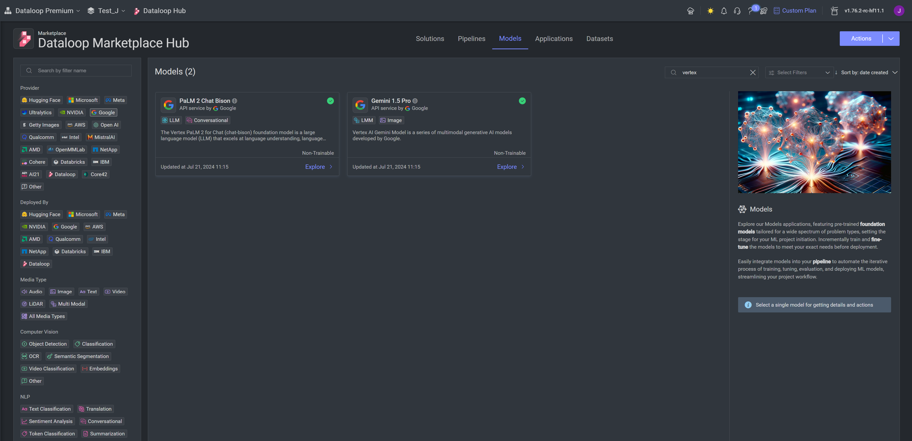
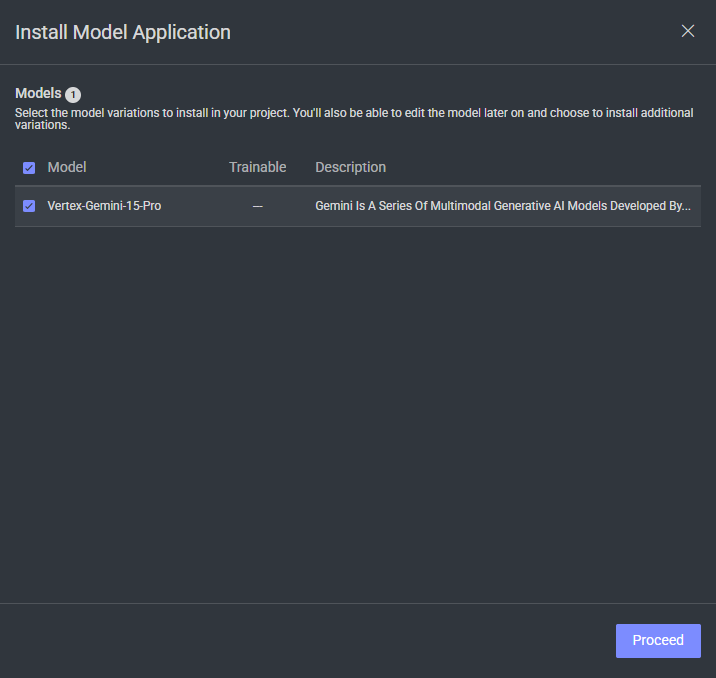
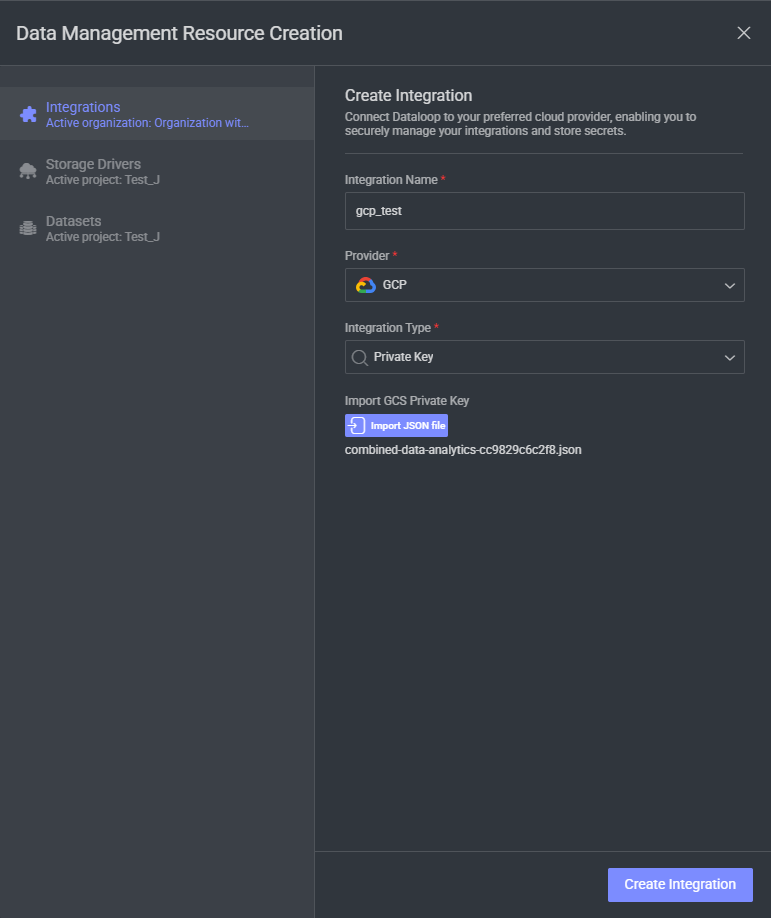
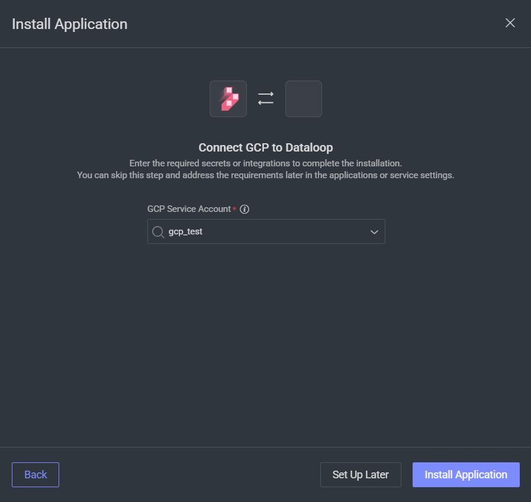
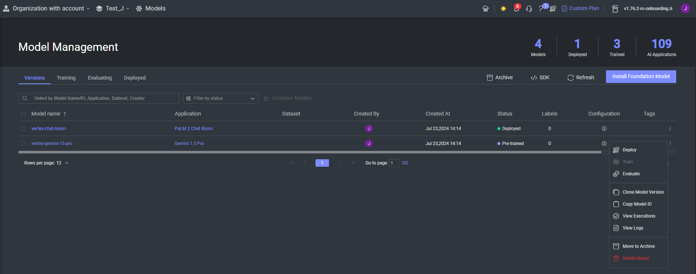
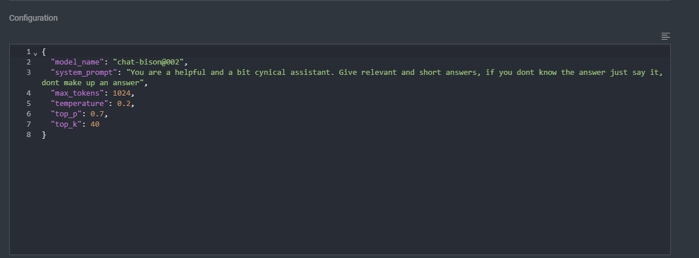

# Vertex AI Model Adapters

Welcome to the repository for Dataloop model adapters that utilize Google Vertex AI models. Follow the instructions below to set up and use these adapters effectively.

For more information on Vertex AI models, refer to the [official documentation](https://cloud.google.com/vertex-ai/generative-ai/docs/learn/models).

## Supported Models

- **Mistral OCR 2505** - Advanced OCR model for extracting text from images and PDF documents

## Setting Up Your GCP Project

To use these models, you need a Google Cloud Platform (GCP) project. Follow these steps to get started:

### 1. Enable the Vertex AI API
   - Navigate to the API Library in the GCP Console.
   - Enable the Vertex AI API.

### 2. Create a [Service Account](https://docs.dataloop.ai/docs/private-key-integration?highlight=create%20service%20account)
   - Go to the IAM & Admin section in the GCP Console.
   - Create a new service account.
   - Generate a new key and download the service account JSON file.

### 3. Assign Permissions
   - Grant the service account the `aiplatform.endpoints.predict` permission.

## Integrating Google Vertex AI with Dataloop Platform

   - Visit the [Dataloop Marketplace](https://docs.dataloop.ai/docs/marketplace), under Models tab.

   - Select the model and click on "Install" and then "Proceed".

   - Select an existing GCP integration or add a new one by importing the JSON file you previously downloaded.

   - Install the model.

### Use the model and change model's configuration

- This model supports two input modes:
  1. **Direct File Input**: Upload images or PDF files directly for OCR processing
  2. **Prompt Items**: Use prompt items containing image or PDF references. You can find more information about prompt items [here](https://developers.dataloop.ai/tutorials/annotations/prompts/chapter).

- Go to 'Models' page.

- Select the model configuration you want to update.  
  

- Here, you can change parameters for your model under 'Configuration':
  - **"model_id"**: Mistral OCR model identifier (default: "mistral-ocr-2505").

### Supported File Types

- **Images**: JPEG, PNG, and other common image formats
- **Documents**: PDF files (single or multi-page)

### Output

The model returns OCR results as text annotations containing the extracted text from your images or PDF documents. For multi-page PDFs, text from all pages is extracted and combined.

---

### Attributions

This application, developed by Dataloop, provides an adapter for Mistral OCR model via Google Vertex AI. While the code in this repository is open-sourced under the Apache License 2.0, the use of Google Vertex AI and Mistral models is subject to Google's and Mistral's licensing terms, including but not limited to:

- [Google Cloud Platform Terms of Service](https://cloud.google.com/terms)
- [Vertex AI Terms of Service](https://cloud.google.com/terms/service-terms#vertex_ai_models)
- [Mistral AI Terms of Service](https://mistral.ai/terms/)

### Important Note

By using this application with Google Vertex AI and Mistral OCR models, you acknowledge that:
1. You have reviewed and agreed to Google's and Mistral's licensing terms for the use of their respective services.
2. You are solely responsible for ensuring compliance with these terms when using Google Vertex AI and Mistral OCR models.
3. The authors of this application, Dataloop, are not responsible for any compliance issues, fees, or damages arising from the use of Google Vertex AI or Mistral models.

This application is provided "as is" under the terms of the Apache License 2.0. Dataloop makes no warranties or guarantees regarding the performance, functionality, or legal compliance of this adapter when used with Google Vertex AI or Mistral OCR models.

### Additional Resources

For more information about the models and services, please visit the official documentation:
- [Google Vertex AI Models](https://cloud.google.com/vertex-ai/generative-ai/docs/learn/models)
- [Mistral AI](https://mistral.ai/)

For additional assistance or inquiries, please refer to the Dataloop documentation or contact support.
