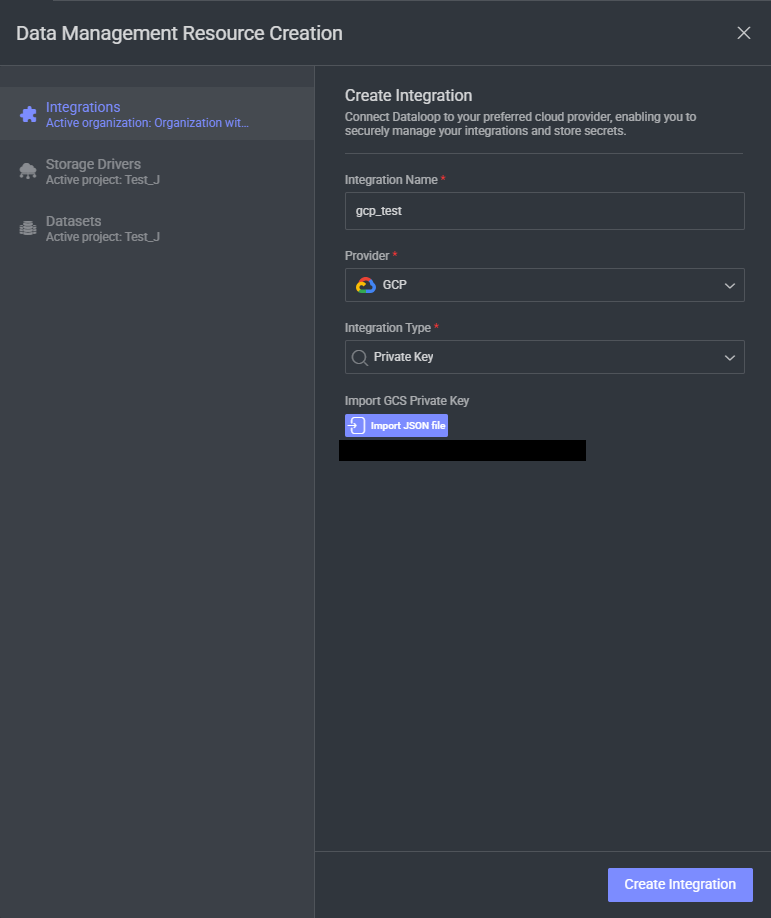

# Vertex AI Model Adapters

Welcome to the repository for Dataloop model adapters that utilize Google Vertex AI models. Follow the instructions below to set up and use these adapters effectively.

For more information on Vertex AI models, refer to the [official documentation](https://cloud.google.com/vertex-ai/generative-ai/docs/learn/models).

## Supported Models

- **Mistral OCR 2505** - Advanced OCR model for extracting text from images and PDF documents
- **Claude 4 Opus** - Anthropic's most powerful multimodal AI model for advanced text and image analysis

## Setting Up Your GCP Project

To use these models, you need a Google Cloud Platform (GCP) project. Follow these steps to get started:

### 1. Enable the Vertex AI API
   - Navigate to the API Library in the GCP Console.
   - Enable the Vertex AI API.

### 2. Create a [Service Account](https://docs.dataloop.ai/docs/private-key-integration?highlight=create%20service%20account)
   - Go to the IAM & Admin section in the GCP Console.
   - Create a new service account.
   - Generate a new key and download the service account JSON file.

### 3. Assign Permissions
   - Grant the service account the `aiplatform.endpoints.predict` permission.

## Integrating Google Vertex AI with Dataloop Platform

   - Visit the [Dataloop Marketplace](https://docs.dataloop.ai/docs/marketplace), under Models tab.

   - Select the model and click on "Install" and then "Proceed".

   - Select an existing GCP integration or add a new one by importing the JSON file you previously downloaded.

   - Install the model.

## Model Usage and Configuration

### Mistral OCR 2505

- **Expected Workflow**: This model is designed to work primarily with **Prompt Items** for optimal text analysis capabilities. Prompt items allow for better organization and analysis of extracted text through proper annotations.

- This model supports two input modes:
  1. **Prompt Items** (Recommended): Use prompt items containing image or PDF references. This is the preferred method as extracted text is stored as proper annotations, enabling better analysis and workflow integration. Learn how to create prompt items [here](https://developers.dataloop.ai/tutorials/annotations/prompts/chapter).
  2. **Direct File Input**: Upload images or PDF files directly for OCR processing. When using this method, extracted text will be stored in the item description, which is not optimal for text analysis workflows.

- Go to 'Models' page.

- Select the model configuration you want to update.  
  

- Here, you can change parameters for your model under 'Configuration':
  - **"model_id"**: Mistral OCR model identifier (default: "mistral-ocr-2505").

#### Supported File Types
- **Images**: JPEG, PNG, and other common image formats
- **Documents**: PDF files (single or multi-page)

#### Output
**For Prompt Items (Recommended)**: The model returns OCR results as text annotations containing the extracted text from your images or PDF documents. This format enables proper text analysis, search, and integration with Dataloop's annotation workflows.

**For Direct File Input**: The extracted text is stored in the item description field. While functional, this approach limits analysis capabilities and is not recommended for production workflows.

For multi-page PDFs, text from all pages is extracted and combined regardless of input method.

### Claude 4 Opus

- **Expected Workflow**: This model works **exclusively with Prompt Items** for advanced multimodal AI conversations and analysis. The model excels at understanding complex instructions, analyzing images, and providing detailed responses.

- **Prompt Items Only**: Claude 4 Opus only accepts prompt items containing text and/or image references. Direct file input is not supported. This ensures optimal integration with Dataloop's annotation workflows and enables proper conversation tracking.

- Configuration parameters:
  - **"model_id"**: Claude 4 Opus model identifier (default: "claude-opus-4@20250514")
  - **"max_tokens"**: Maximum number of tokens in the response (default: 1024)

#### Supported Content Types in Prompts
- **Text**: Any text-based instructions, questions, or content
- **Images**: JPEG, PNG, GIF, WebP formats embedded in prompt items
- **Multimodal**: Combined text and image content for comprehensive analysis

#### Output
The model returns detailed text responses as annotations linked to the specific prompt. These responses can include:
- Image analysis and description
- Question answering based on visual and textual content
- Complex reasoning and problem-solving
- Code generation and analysis
- Creative writing and content generation

#### Regional Availability
Claude 4 Opus is available in the `us-east5` region by default. Ensure your GCP project has access to this region for optimal performance.

---

### Attributions

This application, developed by Dataloop, provides adapters for AI models via Google Vertex AI. While the code in this repository is open-sourced under the Apache License 2.0, the use of Google Vertex AI and the respective AI models is subject to the providers' licensing terms, including but not limited to:

- [Google Cloud Platform Terms of Service](https://cloud.google.com/terms)
- [Vertex AI Terms of Service](https://cloud.google.com/terms/service-terms#vertex_ai_models)
- [Mistral AI Terms of Service](https://mistral.ai/terms/)
- [Anthropic Terms of Service](https://www.anthropic.com/terms)

### Important Note

By using this application with Google Vertex AI and the respective AI models, you acknowledge that:
1. You have reviewed and agreed to Google's and the AI providers' licensing terms for the use of their respective services.
2. You are solely responsible for ensuring compliance with these terms when using Google Vertex AI and the AI models.
3. The authors of this application, Dataloop, are not responsible for any compliance issues, fees, or damages arising from the use of Google Vertex AI or the AI models.

This application is provided "as is" under the terms of the Apache License 2.0. Dataloop makes no warranties or guarantees regarding the performance, functionality, or legal compliance of these adapters when used with Google Vertex AI or the AI models.

### Additional Resources

For more information about the models and services, please visit the official documentation:
- [Google Vertex AI Models](https://cloud.google.com/vertex-ai/generative-ai/docs/learn/models)
- [Mistral AI](https://mistral.ai/)
- [Anthropic Claude](https://www.anthropic.com/)

For additional assistance or inquiries, please refer to the Dataloop documentation or contact support.
